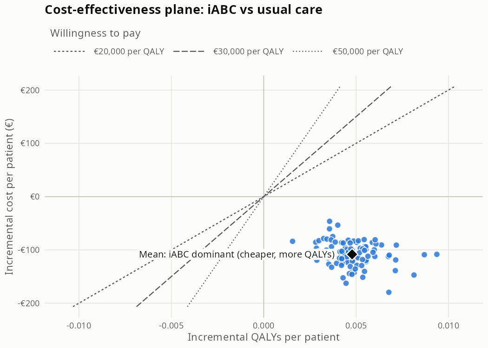

# affirmoTM

**affirmoTM** is an R package for the cost-effectiveness analysis of the AFFIRMO **iABC pathway** compared with
**usual care** in older adults with atrial fibrillation and multimorbidity.

It simulates a cohort of patients one year at a time through two transition matrices, one per arm. Each patient moves
between health states such as no event, acute and past ischaemic or haemorrhagic stroke, major bleeding, and death.
Every year in a state carries a cost and a QALY weight. The package reports costs, QALYs and events for each arm, the
incremental cost and QALYs, the ICER, and the cost-effectiveness plane with willingness-to-pay lines.

You supply the inputs as CSV files: the transition matrices, the cohort, entry states, costs and utilities, plus a
`settings.yaml` file. Example files come with the package, so you can run it straight away.

> **Status:** in development.

## Installation

You need [R](https://cran.r-project.org) and, ideally, RStudio or Positron.

```r
install.packages("remotes")
remotes::install_github("RonyEA/affirmoTM")
```

R also installs the packages affirmoTM needs. Run the same line again to update.

## Quick start

1. Create an empty folder for your analysis, for example `my_analysis`. Open it in RStudio or Positron as a project
   (or `setwd()` to it), so that it is R's working directory.
2. Copy the example input files into it and run the model:

```r
library(affirmoTM)

tm_example_inputs()       # creates inputs/ with the example files
results <- tm_run()       # reads inputs/, runs the model, writes outputs/
results                   # costs, QALYs and events per arm; the difference and the ICER
plot(results)             # the cost-effectiveness plane
```

With the example inputs:

```
iABC minus usual care (mean over runs, per patient):
  Incremental cost:   €-108.37 (intervention cost: €37.5)
  Incremental QALYs:  0.00478
  ICER:               iABC dominant (cheaper, more QALYs)
  Difference in events (whole cohort): ischaemic_stroke -32.7, haemorrhagic_stroke -8.0, major_bleed -13.0, deaths -2.1
```



Each point is one run of the simulation, and the diamond is the mean across runs. The dashed lines are
willingness-to-pay thresholds; points below a line are cost-effective at that threshold.

3. Replace the files in `inputs/` with your own, keeping the same names and layouts, and run `tm_run()` again.

## Your analysis folder

```
my_analysis/                          <- R's working directory
├── inputs/
│   ├── settings.yaml                 <- run settings (horizon, discount rate, runs, seed, WTP lines, …)
│   ├── transition_matrix_usual_care.csv
│   ├── transition_matrix_iabc.csv    <- same states and stratification as usual care
│   ├── cohort.csv                    <- one row per patient: id, age (in the entry cycle), sex, cluster, entry cycle
│   ├── entry_states.csv              <- state in the entry year, by stratum
│   ├── costs.csv                     <- cost of a year in each state, per arm
│   ├── utilities.csv                 <- QALY weight of a year in each living state, per arm
│   └── intervention_cost.csv         <- iABC programme cost per patient, by year after entry
└── outputs/                          <- written by every run of tm_run()
    ├── summary.csv                   <- mean per arm
    ├── summary_by_run.csv            <- one row per run and arm
    ├── comparison.csv                <- iABC minus usual care, and the ICER
    ├── comparison_by_run.csv         <- iABC minus usual care, one row per run
    └── ce_plane.png
```

The file names are fixed. Every input, `settings.yaml` included, is checked before the simulation starts, and any
problem stops the run with a message naming the file and what to fix. A setting name the package does not know, such
as a typo (`event:` for `events:`), gives a warning. The example files and their layouts are described in
[`inst/extdata/example_inputs/README.md`](inst/extdata/example_inputs/README.md).

A few points about the layouts:

- **Age groups:** the age-group column must be called `agegrp`, in every file. It is the only stratifier that changes
  as patients age; a column with any other name (for example `age_band`) is read as a fixed stratifier, so patients
  would keep their entry age group for the whole horizon. Age groups are written as ranges such as `65-69`.
- **Transition matrices:** one row per stratum and current state (`from`), one column per state, holding the probability
  of moving there within one year; every row sums to 1. Every state needs its own rows, death states included: a death
  state's rows go back to the same state with probability 1, which is how the package recognises it. `tm_run()`
  lists the death states it found when it starts: check that no living state is among them. The package
  checks the layout, but the probabilities themselves are your responsibility.
- **Entry year:** a patient's state in their entry year comes from `entry_states.csv` and is the same in both arms.
  The arms differ from the year after entry: each arm's matrix, costs and utilities apply from then on, and in the
  entry year both arms take the `usual_care` cost and utility.
- **Intervention cost:** `intervention_cost.csv` holds the cost of delivering iABC to one patient in each year after
  entry (columns `year` and `cost`, every year from 1 to `horizon - 1`). It is the same whatever the patient's state,
  and is charged to iABC patients alive in that year: never in the entry year, the year of death, or usual care.
  Differences in care that depend on the state, such as medication, belong in the `iabc` column of `costs.csv`.
- **Costs and utilities by stratum (optional):** `costs.csv` and `utilities.csv` may have stratifier columns, any of
  the `strata` in `settings.yaml`: for example utilities by `agegrp` and `sex`, or costs by `mm_cluster`. Each
  patient-year uses the patient's stratum in that year (their current age group, as they age, and their sex and
  cluster), and every stratum needs a row for every state.
- **Changes over time (optional):** a matrix, `costs.csv` or `utilities.csv` may have a `year` column (years since
  entry, 1 = the first year after entry), for example for an effect that lasts one year. Every year from 1 to
  `horizon - 1` then needs a full set of rows; tutorial 2 shows how to build such files.
- **Discount rate:** `discount_rate` in `settings.yaml` is a proportion: write `0.03` for 3%, not `3`.
- **Horizon:** patients in `cohort.csv` who enter in cycle `horizon` or later are left out, with a warning.

## Learning more

- **Tutorials:** six short PDFs in [`tutorials/`](tutorials/README.md): getting started, input files, settings,
  running the model, results, and a walkthrough of one run in detail.
- **Help pages:** every function has one, for example `?tm_run`, `?tm_simulate`, `?tm_example_inputs`.

## Main functions

| Function | What it does |
|---|---|
| `tm_example_inputs()` | Copies the example input files into `inputs/` |
| `tm_run()` | Runs the whole model `n_runs` times and writes `outputs/` |
| `plot(results)` | Draws the cost-effectiveness plane |
| `tm_read_settings()`, `tm_read_matrices()`, `tm_read_cohort()`, `tm_read_entry_states()`, `tm_read_costs()`, `tm_read_utilities()`, `tm_read_intervention_cost()` | Read and check each input |
| `tm_assign_entry_states()`, `tm_simulate()`, `tm_add_outcomes()`, `tm_summarise()`, `tm_compare()` | The steps of a run, for use one at a time |

## About the example inputs

The example files are for learning the package, not for drawing conclusions:

- The **usual-care matrix** comes from a multinomial model fitted to the Swedish National Patient Register.
- The **iABC matrix, costs, utilities and intervention cost are invented**, to show what real files look like. The
  costs and utilities are the same in both arms, and iABC is a one-year programme costing €50 per patient in the first
  year after entry. With these values iABC comes out cheaper and better (dominant).
- The **cohort** is 5,000 patients sampled from an IMPACT_AF synthetic population.

## Licence

GPL (>= 3). See [LICENSE.md](LICENSE.md).

## Acknowledgement

affirmoTM is developed within AFFIRMO, which has received funding from the European Union's Horizon 2020 research
and innovation programme under grant agreement No 899871.
