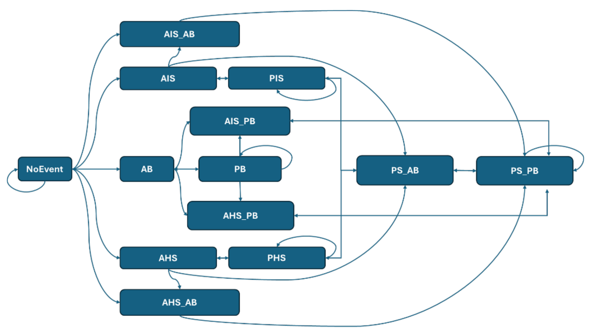

```{r setup}
#| include: false
# Rendering this tutorial: load the package from the repository and work in a fresh, empty analysis folder.
repo <- rprojroot::find_package_root_file()
devtools::load_all(repo, quiet = TRUE)
library(data.table)
analysis <- file.path(tempdir(), "affirmoTM-tutorial-1")
unlink(analysis, recursive = TRUE)
dir.create(analysis)
knitr::opts_knit$set(root.dir = analysis)
knitr::opts_chunk$set(message = FALSE, dev = "cairo_pdf")
if (!isTRUE(getOption("knitr.in.progress"))) setwd(analysis)
options(width = 85)
```

# What affirmoTM does

affirmoTM compares two arms, **iABC** and **usual care**, in a cohort of patients with atrial fibrillation.

- **Yearly cycles:** each patient is followed one year (one *cycle*) at a time. In every year they are in one health
  state.
- **Transitions:** the next year's state is drawn from a transition matrix, one for each arm.
- **Costs and QALYs:** each year in a state carries a cost and a QALY weight.
- **Results:** adding these up gives each arm's costs and QALYs, the difference between the arms, the ICER and the
  cost-effectiveness (CE) plane.

A run of the model:

1. reads the input files from `inputs/` and checks them;
2. gives each patient a state for the year they enter;
3. moves every patient through each arm, year by year, until they die or the time horizon ends;
4. gives every year its cost and QALY, discounted;
5. adds up each arm and compares the arms.

The whole run is repeated several times with different random numbers; each run is one point on the CE plane.

## Health states

The example files use these states. Your own files can use other states: the package reads them from the transition
matrices.

| State | Meaning |
|---|---|
| `NoEvent` | No stroke or major bleed |
| `AIS`, `AHS`, `AB` | Acute ischaemic stroke, haemorrhagic stroke or major bleed this year |
| `PIS`, `PHS`, `PB` | Past ischaemic stroke, haemorrhagic stroke or major bleed |
| `AIS_AB`, `AHS_AB` | Acute stroke and acute bleed this year |
| `PB_AIS`, `PB_AHS` | Past bleed and acute stroke this year (`AIS_PB` and `AHS_PB` in Figure 1) |
| `PS_AB` | Past stroke and acute bleed this year |
| `PS_PB` | Past stroke and past bleed |
| `CurrentDeath` | Death without a new event that year |
| `AB_Death`, `AHS_Death`, `AIS_Death` | Death in the year of that acute event |
| `AHS_AB_Death`, `AIS_AB_Death` | Death in the year of both acute events |

*Acute* means the event happens during the current year; *past* means it happened in an earlier year.

Figure 1 shows the possible moves between the living states. Death states are not drawn; every living state can lead
to death.

{width=85%}

# Installing affirmoTM

You need R, and an editor such as RStudio or Positron. Install affirmoTM once; R also installs the packages it needs.

From GitHub:

```{r install-github}
#| eval: false
install.packages("remotes")
remotes::install_github("RonyEA/affirmoTM")
```

From a copy of the repository on your computer:

```{r install-local}
#| eval: false
remotes::install_local("path/to/affirmoTM")
```

Run the same line again to update.

# An analysis folder

Each analysis lives in its own folder. Create an empty folder, for example `my_analysis`, and make it R's working
directory: open it as a project in RStudio or Positron, or use `setwd()`. affirmoTM reads its inputs from `inputs/`
and writes its results to `outputs/` in that folder.

Load the package and copy the example input files into the folder:

```{r load}
#| eval: false
library(affirmoTM)
```

```{r example-inputs}
tm_example_inputs()
list.files("inputs")
```

The folder now looks like this:

```
my_analysis/
|-- inputs/                       the files you supply (here, the examples)
|   |-- settings.yaml             run settings
|   |-- transition_matrix_usual_care.csv
|   |-- transition_matrix_iabc.csv
|   |-- cohort.csv                the patients
|   |-- entry_states.csv          the state in each patient's first year
|   |-- costs.csv                 the cost of a year in each state
|   |-- utilities.csv             the QALY weight of a year in each state
|   |-- intervention_cost.csv     the cost of delivering iABC
|   `-- README.md                 describes the example files
`-- outputs/                      written by every run
```

`tm_example_inputs()` never replaces files that already exist, unless you ask it to with
`tm_example_inputs(overwrite = TRUE)`.

# A first run

`tm_run()` reads every input, runs the model and writes the results to `outputs/`:

```{r run}
results <- tm_run()
results
```

The printout shows each arm's mean costs, QALYs and events over the runs, then iABC minus usual care: the
incremental cost, the incremental QALYs and the ICER.

The cost-effectiveness plane:

```{r plot}
plot(results)
```

# Where next

| Tutorial | What it covers |
|---|---|
| 2. Input files | Each input file: its layout, its rules, and how to look at it |
| 3. Settings | Each setting in `settings.yaml`, and how to change them |
| 4. Running the model | What `tm_run()` does, and the steps of a run one at a time |
| 5. Results | The results object, the comparison, the CE plane and the output files |
| 6. Walkthrough | One run followed in detail: patients, costs, QALYs and how the arms behave over time |

Each function also has a help page, for example `?tm_run`.
